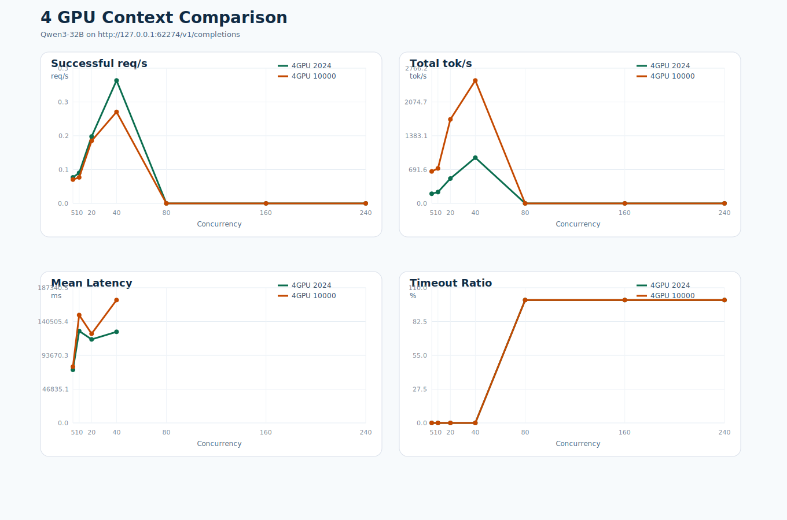
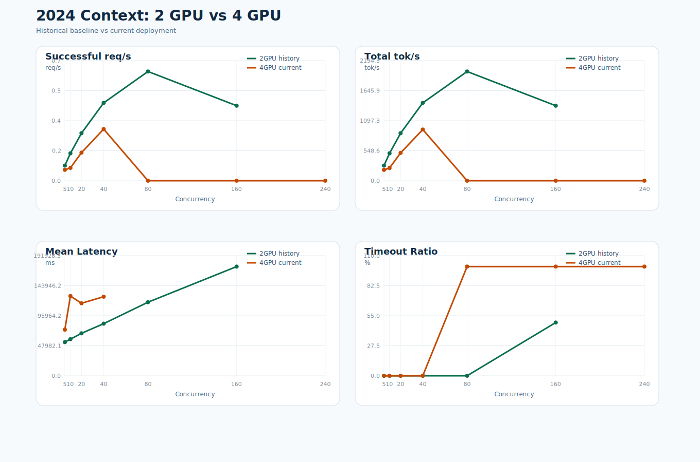
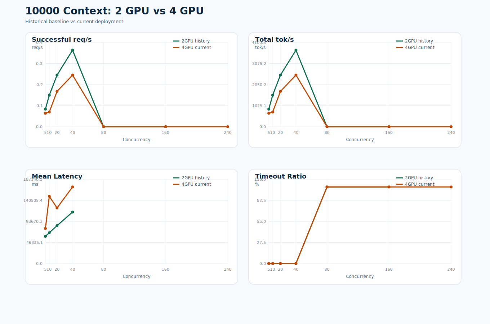

# Qwen3-32B 四卡吞吐对比报告

- 生成时间: 2026-04-03 00:44:19
- 当前服务: `http://127.0.0.1:62274/v1/completions`
- 当前部署环境: `/home/lyq/anaconda3/envs/vllm`
- 当前部署卡数: `4 GPU`
- 历史基线: 仓库内 `2 GPU` 测试结果

## 当前四卡测试口径

- `2024` 上下文: 输入约 `2025` token，输出 `1024` token，并发 `5 10 20 40 80 160 240`。
- `10000` 上下文: 输入约 `10001` token，输出 `1024` token，并发 `5 10 20 40 80 160 240`。
- 客户端 timeout: `180s`。

## 部署方法

### 历史 2 卡基线

- 历史基线直接使用仓库内已有 results_fine 与 results_ctx10k 数据；两组数据均标注为 2 GPU。
- 历史基线接口记录为 http://127.0.0.1:62272/v1/completions，模型路径同样是 /data1/dlx/projects/vllm_xty/model。

### 当前 4 卡部署

- Conda 环境: /home/lyq/anaconda3/envs/vllm。
- 模型路径: /data1/dlx/projects/vllm_xty/model；服务端口: 62274；GPU: 0,1,2,3。
- 启动前必须设置 CUDA_VISIBLE_DEVICES=0,1,2,3、NCCL_P2P_DISABLE=1、NCCL_CUMEM_ENABLE=0，否则 4 卡实例会卡在初始化阶段。
- 可复现启动脚本: /home/lyq/xintuoyin-KLCLAB/deploy_qwen3_32b_vllm_4gpu.sh。
- 启动命令: vllm serve /data1/dlx/projects/vllm_xty/model --host 0.0.0.0 --port 62274 --served-model-name Qwen3-32B --dtype bfloat16 --tensor-parallel-size 4 --generation-config vllm --gpu-memory-utilization 0.9 --max-model-len 12000 --max-num-seqs 128 --disable-custom-all-reduce --enforce-eager。

## 当前四卡结论

- `2024` 上下文最高成功吞吐出现在并发 `40`，约 `0.31` req/s，`934.74` tok/s。
- `10000` 上下文最高成功吞吐出现在并发 `40`，约 `0.23` req/s，`2514.76` tok/s。
- `2024` 上下文首个出现 timeout 的并发点是 `80`，timeout 比例 `100.00%`。
- `10000` 上下文首个出现 timeout 的并发点是 `80`，timeout 比例 `100.00%`。

## 当前四卡 2024 vs 10000

| 并发 | 2024 成功 | 2024 Timeout% | 2024 req/s | 2024 tok/s | 10000 成功 | 10000 Timeout% | 10000 req/s | 10000 tok/s |
| ---: | ---: | ---: | ---: | ---: | ---: | ---: | ---: | ---: |
| 5 | 10 | 0.00% | 0.06 | 197.61 | 10 | 0.00% | 0.06 | 653.98 |
| 10 | 10 | 0.00% | 0.08 | 231.93 | 10 | 0.00% | 0.06 | 715.77 |
| 20 | 20 | 0.00% | 0.17 | 508.47 | 20 | 0.00% | 0.16 | 1719.39 |
| 40 | 40 | 0.00% | 0.31 | 934.74 | 40 | 0.00% | 0.23 | 2514.76 |
| 80 | 0 | 100.00% | 0.00 | 0.00 | 0 | 100.00% | 0.00 | 0.00 |
| 160 | 0 | 100.00% | 0.00 | 0.00 | 0 | 100.00% | 0.00 | 0.00 |
| 240 | 0 | 100.00% | 0.00 | 0.00 | 0 | 100.00% | 0.00 | 0.00 |

## 历史 2 卡 vs 当前 4 卡: 2024 上下文

| 并发 | 2卡 req/s | 4卡 req/s | req/s 变化 | 2卡 tok/s | 4卡 tok/s | tok/s 变化 | 2卡 Timeout% | 4卡 Timeout% |
| ---: | ---: | ---: | ---: | ---: | ---: | ---: | ---: | ---: |
| 5 | 0.09 | 0.06 | -27.70% | 275.46 | 197.61 | -28.26% | 0.00% | 0.00% |
| 10 | 0.16 | 0.08 | -53.24% | 499.92 | 231.93 | -53.61% | 0.00% | 0.00% |
| 20 | 0.28 | 0.17 | -40.90% | 867.14 | 508.47 | -41.36% | 0.00% | 0.00% |
| 40 | 0.46 | 0.31 | -33.75% | 1422.06 | 934.74 | -34.27% | 0.00% | 0.00% |
| 80 | 0.65 | 0.00 | -100.00% | 1995.00 | 0.00 | -100.00% | 0.00% | 100.00% |
| 160 | 0.45 | 0.00 | -100.00% | 1370.26 | 0.00 | -100.00% | 48.75% | 100.00% |

## 历史 2 卡 vs 当前 4 卡: 10000 上下文

| 并发 | 2卡 req/s | 4卡 req/s | req/s 变化 | 2卡 tok/s | 4卡 tok/s | tok/s 变化 | 2卡 Timeout% | 4卡 Timeout% |
| ---: | ---: | ---: | ---: | ---: | ---: | ---: | ---: | ---: |
| 5 | 0.08 | 0.06 | -23.51% | 855.01 | 653.98 | -23.51% | 0.00% | 0.00% |
| 10 | 0.14 | 0.06 | -53.36% | 1534.78 | 715.77 | -53.36% | 0.00% | 0.00% |
| 20 | 0.23 | 0.16 | -31.57% | 2512.57 | 1719.39 | -31.57% | 0.00% | 0.00% |
| 40 | 0.34 | 0.23 | -32.54% | 3727.55 | 2514.76 | -32.54% | 0.00% | 0.00% |
| 80 | 0.00 | 0.00 | N/A | 0.00 | 0.00 | N/A | 100.00% | 100.00% |
| 160 | 0.00 | 0.00 | N/A | 0.00 | 0.00 | N/A | 100.00% | 100.00% |

## 原始产物

- 当前 2024 汇总: `results_4gpu_ctx2024/summary.csv`
- 当前 10000 汇总: `results_4gpu_ctx10k/summary.csv`
- 当前 2024 图表: `results_4gpu_ctx2024/benchmark.svg`
- 当前 10000 图表: `results_4gpu_ctx10k/benchmark.svg`
- 历史对比表: `historical_comparison.csv`
