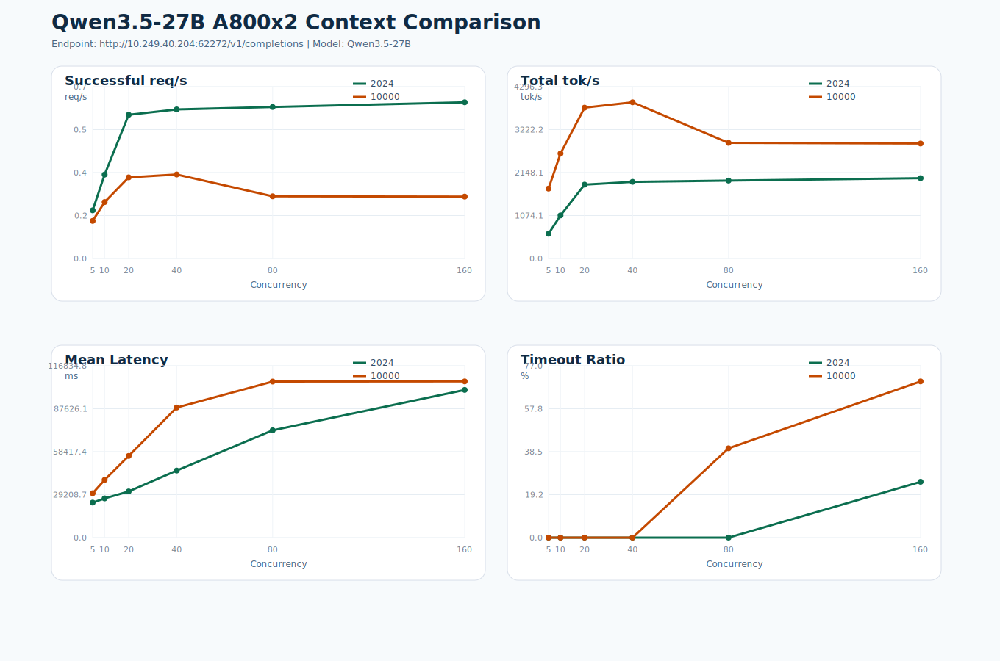

# Qwen3.5-27B A800 双卡压测报告

- 生成时间: 2026-04-03 21:48:12
- 接口: `http://10.249.40.204:62272/v1/completions`
- 模型: `Qwen3.5-27B`
- 环境标记: `A800x2-Qwen3.5-27B`
- `2024` 输入实际约 `2025` token，输出 `1024` token。
- `10000` 输入实际约 `10001` token，输出 `1024` token。
- 并发档位: `5 10 20 40 80 160`
- 客户端 timeout: `180s`

## 部署信息

- 来源: `backend/script/setting.sh`
- DB/Chat Base URL: `http://10.249.40.204:62272/v1`
- 服务模型: `Qwen3.5-27B`
- 硬件说明: 用户指定为 `A800 2卡`
- setting.sh 中 OPENAI_API_BASE 与 DB_LLM_BASE_URL 都指向 http://10.249.40.204:62272/v1。
- 本次 benchmark 使用 /v1/completions，模型名 Qwen3.5-27B。

## 核心结论

- `2024` 最佳吞吐出现在并发 `160`，约 `0.66` req/s，`2007.69` tok/s。
- `10000` 最佳吞吐出现在并发 `40`，约 `0.35` req/s，`3905.71` tok/s。
- `2024` 首个出现 timeout 的并发点是 `160`，timeout 比例 `25.00%`。
- `10000` 首个出现 timeout 的并发点是 `80`，timeout 比例 `40.00%`。

## 对比图

## 对比表

| 并发 | 2024 成功 | 2024 Timeout% | 2024 Mean(ms) | 2024 req/s | 2024 tok/s | 10000 成功 | 10000 Timeout% | 10000 Mean(ms) | 10000 req/s | 10000 tok/s |
| ---: | ---: | ---: | ---: | ---: | ---: | ---: | ---: | ---: | ---: | ---: |
| 5 | 10 | 0.00% | 23803.92 | 0.20 | 619.20 | 10 | 0.00% | 30170.33 | 0.16 | 1748.07 |
| 10 | 10 | 0.00% | 26662.90 | 0.35 | 1078.55 | 10 | 0.00% | 39223.37 | 0.24 | 2625.41 |
| 20 | 20 | 0.00% | 31388.35 | 0.61 | 1846.72 | 20 | 0.00% | 55519.88 | 0.34 | 3771.51 |
| 40 | 40 | 0.00% | 45587.17 | 0.63 | 1916.19 | 40 | 0.00% | 88440.02 | 0.35 | 3905.71 |
| 80 | 80 | 0.00% | 72956.08 | 0.64 | 1947.42 | 48 | 40.00% | 106123.52 | 0.26 | 2891.97 |
| 160 | 120 | 25.00% | 100400.25 | 0.66 | 2007.69 | 48 | 70.00% | 106213.46 | 0.26 | 2876.01 |

## 原始产物

- `2024` 汇总: `vllm_test/results_a800_2gpu_ctx2024/summary.csv`
- `2024` 单组报告: `vllm_test/results_a800_2gpu_ctx2024/report.md`
- `10000` 汇总: `vllm_test/results_a800_2gpu_ctx10k/summary.csv`
- `10000` 单组报告: `vllm_test/results_a800_2gpu_ctx10k/report.md`
- 对比表 CSV: `vllm_test/report_a800_2gpu_qwen35_27b/comparison.csv`
