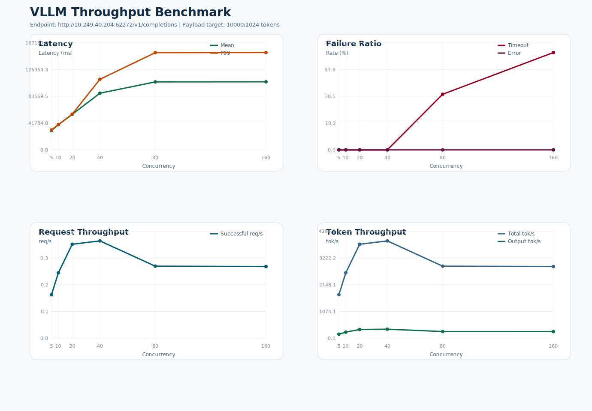

# VLLM 吞吐测试报告

- 测试时间: 2026-04-03 21:46:31
- Conda 环境: `A800x2-Qwen3.5-27B`
- 基准接口: `http://10.249.40.204:62272/v1/completions`
- 模型名: `Qwen3.5-27B`
- 模型路径: `/data2/dlx/models/base4/Qwen3.5-27B`
- tokenizer 路径: `/data2/lyq/models/Qwen3.5-27B`
- 目标负载: 输入 `10000` token, 输出 `1024` token
- 实际构造 prompt token 数: 约 `10001`
- 客户端超时阈值: `180` 秒
- 请求数策略: `max(并发数, 10)`

## 结果概览

- 最高成功吞吐出现在并发 `40`，约 `0.35` req/s。
- 最低 timeout 比例出现在并发 `5`，约 `0.00%`。
- 详细汇总见 `summary.csv`，图表见 `benchmark.svg`。

## 汇总表

| 并发数 | 请求数 | 成功 | 失败 | Timeout | Error | Mean Latency(ms) | P99(ms) | Timeout% | Error% | Success req/s | Total tok/s |
| ---: | ---: | ---: | ---: | ---: | ---: | ---: | ---: | ---: | ---: | ---: | ---: |
| 5 | 10 | 10 | 0 | 0 | 0 | 30170.33 | 31162.86 | 0.00 | 0.00 | 0.16 | 1748.07 |
| 10 | 10 | 10 | 0 | 0 | 0 | 39223.37 | 39328.27 | 0.00 | 0.00 | 0.24 | 2625.41 |
| 20 | 20 | 20 | 0 | 0 | 0 | 55519.88 | 55788.93 | 0.00 | 0.00 | 0.34 | 3771.51 |
| 40 | 40 | 40 | 0 | 0 | 0 | 88440.02 | 110205.19 | 0.00 | 0.00 | 0.35 | 3905.71 |
| 80 | 80 | 48 | 32 | 32 | 0 | 106123.52 | 151752.40 | 40.00 | 0.00 | 0.26 | 2891.97 |
| 160 | 160 | 48 | 112 | 112 | 0 | 106213.46 | 151944.55 | 70.00 | 0.00 | 0.26 | 2876.01 |

## 说明

- `Error%` 仅统计非 timeout 失败请求占比，例如 HTTP 5xx 或连接异常。
- `Timeout%` 单独统计客户端在超时阈值内未收到完整响应的请求占比。
- 延迟统计仅基于成功请求的端到端响应时间。

