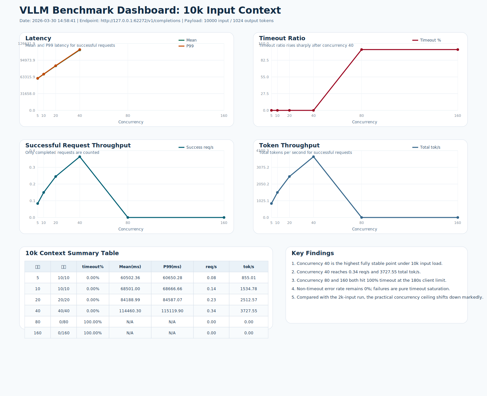
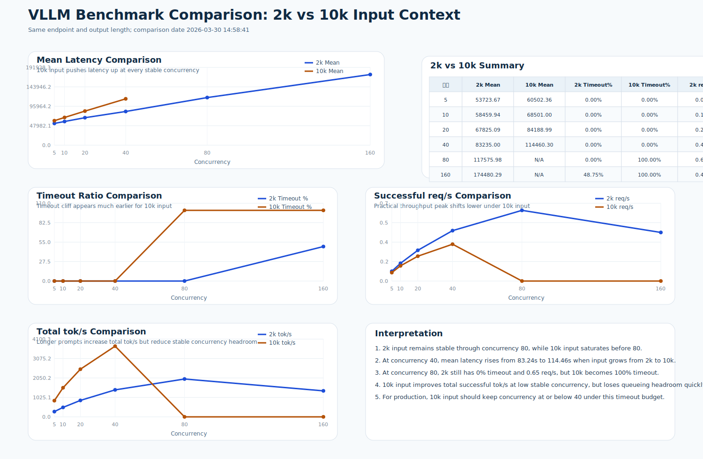

# VLLM 10k Context 吞吐测试报告

- 测试时间: 2026-03-30 14:58:41
- Conda 环境: `xtyAgent`
- 基准接口: `http://127.0.0.1:62272/v1/completions`
- 模型名: `Qwen3-32B`
- 输入长度: 约 `10001` token
- 输出长度: `1024` token
- 并发集合: `5 10 20 40 80 160`
- 客户端 timeout: `180s`
- 请求数策略: `max(并发数, 10)`

## 结论

- 在 `1w` 输入负载下，最高完全稳定并发点是 `40`，成功吞吐约 `0.34` req/s，总 token 吞吐约 `3727.55` tok/s。
- 并发 `80` 和 `160` 都是 `100% timeout`，说明在当前 `180s` 超时预算下，系统容量拐点已经落在 `40` 与 `80` 之间。
- 非 timeout error 仍然是 `0`，失败全部来自排队/推理时间过长导致的 timeout。

## 汇总表

| 并发数 | 请求数 | 成功 | Timeout | Mean(ms) | P99(ms) | Timeout% | Success req/s | Total tok/s |
| ---: | ---: | ---: | ---: | ---: | ---: | ---: | ---: | ---: |
| 5 | 10 | 10 | 0 | 60502.36 | 60650.28 | 0.00% | 0.08 | 855.01 |
| 10 | 10 | 10 | 0 | 68501.00 | 68666.66 | 0.00% | 0.14 | 1534.78 |
| 20 | 20 | 20 | 0 | 84188.99 | 84587.07 | 0.00% | 0.23 | 2512.57 |
| 40 | 40 | 40 | 0 | 114460.30 | 115119.90 | 0.00% | 0.34 | 3727.55 |
| 80 | 80 | 0 | 80 | N/A | N/A | 100.00% | 0.00 | 0.00 |
| 160 | 160 | 0 | 160 | N/A | N/A | 100.00% | 0.00 | 0.00 |

## 图表

## 对比图

