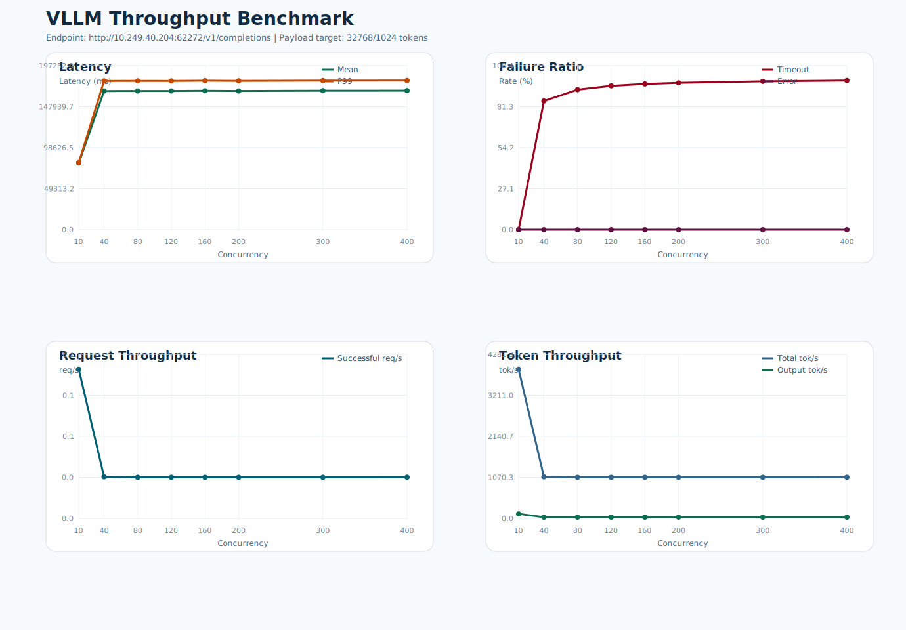

# VLLM 吞吐测试报告

- 测试时间: 2026-04-10 17:07:13
- Conda 环境: `context-matrix-Qwen3.5-27B`
- 基准接口: `http://10.249.40.204:62272/v1/completions`
- 模型名: `Qwen3.5-27B`
- 模型路径: `/data2/lyq/models/Qwen3.5-27B`
- tokenizer 路径: `/data2/lyq/models/Qwen3.5-27B`
- 目标负载: 输入 `32768` token, 输出 `1024` token
- 实际构造 prompt token 数: 约 `32769`
- 客户端超时阈值: `180` 秒
- 请求数策略: `max(并发数, 10)`

## 结果概览

- 最高成功吞吐出现在并发 `10`，约 `0.12` req/s。
- 最低 timeout 比例出现在并发 `10`，约 `0.00%`。
- 详细汇总见 `summary.csv`，图表见 `benchmark.svg`。

## 汇总表

| 并发数 | 请求数 | 成功 | 失败 | Timeout | Error | Mean Latency(ms) | P99(ms) | Timeout% | Error% | Success req/s | Total tok/s |
| ---: | ---: | ---: | ---: | ---: | ---: | ---: | ---: | ---: | ---: | ---: | ---: |
| 10 | 10 | 10 | 0 | 0 | 0 | 80189.04 | 80609.50 | 0.00 | 0.00 | 0.12 | 3892.11 |
| 40 | 40 | 6 | 34 | 34 | 0 | 166709.48 | 178866.66 | 85.00 | 0.00 | 0.03 | 1083.82 |
| 80 | 80 | 6 | 74 | 74 | 0 | 166784.91 | 178929.72 | 92.50 | 0.00 | 0.03 | 1072.71 |
| 120 | 120 | 6 | 114 | 114 | 0 | 166765.01 | 178893.10 | 95.00 | 0.00 | 0.03 | 1072.89 |
| 160 | 160 | 6 | 154 | 154 | 0 | 167010.18 | 179192.91 | 96.25 | 0.00 | 0.03 | 1072.87 |
| 200 | 200 | 6 | 194 | 194 | 0 | 166822.97 | 178966.09 | 97.00 | 0.00 | 0.03 | 1072.80 |
| 300 | 300 | 6 | 294 | 294 | 0 | 167089.12 | 179270.60 | 98.00 | 0.00 | 0.03 | 1072.75 |
| 400 | 400 | 6 | 394 | 394 | 0 | 167162.57 | 179320.86 | 98.50 | 0.00 | 0.03 | 1072.92 |

## 说明

- `Error%` 仅统计非 timeout 失败请求占比，例如 HTTP 5xx 或连接异常。
- `Timeout%` 单独统计客户端在超时阈值内未收到完整响应的请求占比。
- 延迟统计仅基于成功请求的端到端响应时间。

