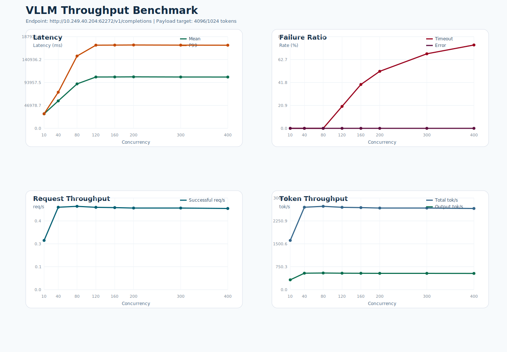

# VLLM 吞吐测试报告

- 测试时间: 2026-04-10 16:00:15
- Conda 环境: `context-matrix-Qwen3.5-27B`
- 基准接口: `http://10.249.40.204:62272/v1/completions`
- 模型名: `Qwen3.5-27B`
- 模型路径: `/data2/lyq/models/Qwen3.5-27B`
- tokenizer 路径: `/data2/lyq/models/Qwen3.5-27B`
- 目标负载: 输入 `4096` token, 输出 `1024` token
- 实际构造 prompt token 数: 约 `4097`
- 客户端超时阈值: `180` 秒
- 请求数策略: `max(并发数, 10)`

## 结果概览

- 最高成功吞吐出现在并发 `80`，约 `0.53` req/s。
- 最低 timeout 比例出现在并发 `10`，约 `0.00%`。
- 详细汇总见 `summary.csv`，图表见 `benchmark.svg`。

## 汇总表

| 并发数 | 请求数 | 成功 | 失败 | Timeout | Error | Mean Latency(ms) | P99(ms) | Timeout% | Error% | Success req/s | Total tok/s |
| ---: | ---: | ---: | ---: | ---: | ---: | ---: | ---: | ---: | ---: | ---: | ---: |
| 10 | 10 | 10 | 0 | 0 | 0 | 29794.94 | 29842.82 | 0.00 | 0.00 | 0.31 | 1611.94 |
| 40 | 40 | 40 | 0 | 0 | 0 | 56251.53 | 74021.50 | 0.00 | 0.00 | 0.53 | 2698.46 |
| 80 | 80 | 80 | 0 | 0 | 0 | 91087.36 | 148241.43 | 0.00 | 0.00 | 0.53 | 2728.40 |
| 120 | 120 | 96 | 24 | 24 | 0 | 105201.79 | 170501.13 | 20.00 | 0.00 | 0.53 | 2696.38 |
| 160 | 160 | 96 | 64 | 64 | 0 | 105331.99 | 170633.48 | 40.00 | 0.00 | 0.52 | 2686.54 |
| 200 | 200 | 96 | 104 | 104 | 0 | 105525.47 | 170831.79 | 52.00 | 0.00 | 0.52 | 2671.97 |
| 300 | 300 | 96 | 204 | 204 | 0 | 105202.07 | 170523.82 | 68.00 | 0.00 | 0.52 | 2671.78 |
| 400 | 400 | 96 | 304 | 304 | 0 | 105174.50 | 170419.85 | 76.00 | 0.00 | 0.52 | 2657.49 |

## 说明

- `Error%` 仅统计非 timeout 失败请求占比，例如 HTTP 5xx 或连接异常。
- `Timeout%` 单独统计客户端在超时阈值内未收到完整响应的请求占比。
- 延迟统计仅基于成功请求的端到端响应时间。

