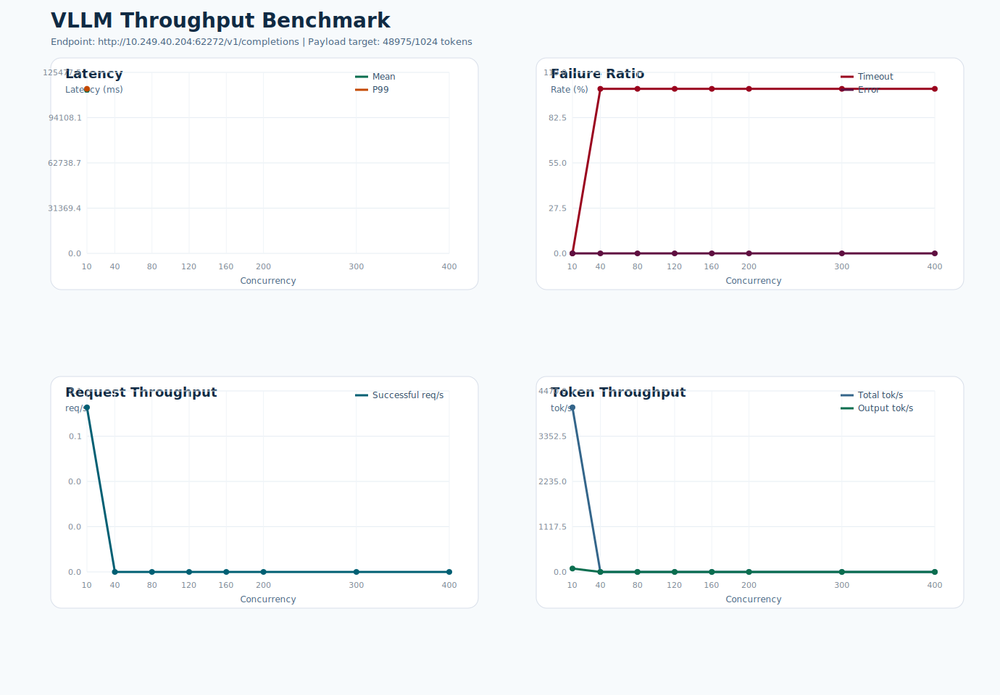

# VLLM 吞吐测试报告

- 测试时间: 2026-04-10 18:43:54
- Conda 环境: `context-matrix-Qwen3.5-27B`
- 基准接口: `http://10.249.40.204:62272/v1/completions`
- 模型名: `Qwen3.5-27B`
- 模型路径: `/data2/lyq/models/Qwen3.5-27B`
- tokenizer 路径: `/data2/lyq/models/Qwen3.5-27B`
- 目标负载: 输入 `48975` token, 输出 `1024` token
- 实际构造 prompt token 数: 约 `48976`
- 客户端超时阈值: `180` 秒
- 请求数策略: `max(并发数, 10)`

## 结果概览

- 最高成功吞吐出现在并发 `10`，约 `0.08` req/s。
- 最低 timeout 比例出现在并发 `10`，约 `0.00%`。
- 详细汇总见 `summary.csv`，图表见 `benchmark.svg`。

## 汇总表

| 并发数 | 请求数 | 成功 | 失败 | Timeout | Error | Mean Latency(ms) | P99(ms) | Timeout% | Error% | Success req/s | Total tok/s |
| ---: | ---: | ---: | ---: | ---: | ---: | ---: | ---: | ---: | ---: | ---: | ---: |
| 10 | 10 | 10 | 0 | 0 | 0 | 113400.04 | 114070.42 | 0.00 | 0.00 | 0.08 | 4063.61 |
| 40 | 40 | 0 | 40 | 40 | 0 | N/A | N/A | 100.00 | 0.00 | 0.00 | 0.00 |
| 80 | 80 | 0 | 80 | 80 | 0 | N/A | N/A | 100.00 | 0.00 | 0.00 | 0.00 |
| 120 | 120 | 0 | 120 | 120 | 0 | N/A | N/A | 100.00 | 0.00 | 0.00 | 0.00 |
| 160 | 160 | 0 | 160 | 160 | 0 | N/A | N/A | 100.00 | 0.00 | 0.00 | 0.00 |
| 200 | 200 | 0 | 200 | 200 | 0 | N/A | N/A | 100.00 | 0.00 | 0.00 | 0.00 |
| 300 | 300 | 0 | 300 | 300 | 0 | N/A | N/A | 100.00 | 0.00 | 0.00 | 0.00 |
| 400 | 400 | 0 | 400 | 400 | 0 | N/A | N/A | 100.00 | 0.00 | 0.00 | 0.00 |

## 说明

- `Error%` 仅统计非 timeout 失败请求占比，例如 HTTP 5xx 或连接异常。
- `Timeout%` 单独统计客户端在超时阈值内未收到完整响应的请求占比。
- 延迟统计仅基于成功请求的端到端响应时间。

