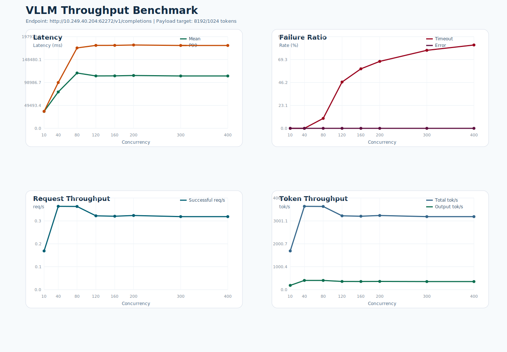

# VLLM 吞吐测试报告

- 测试时间: 2026-04-10 16:21:24
- Conda 环境: `context-matrix-Qwen3.5-27B`
- 基准接口: `http://10.249.40.204:62272/v1/completions`
- 模型名: `Qwen3.5-27B`
- 模型路径: `/data2/lyq/models/Qwen3.5-27B`
- tokenizer 路径: `/data2/lyq/models/Qwen3.5-27B`
- 目标负载: 输入 `8192` token, 输出 `1024` token
- 实际构造 prompt token 数: 约 `8193`
- 客户端超时阈值: `180` 秒
- 请求数策略: `max(并发数, 10)`

## 结果概览

- 最高成功吞吐出现在并发 `40`，约 `0.39` req/s。
- 最低 timeout 比例出现在并发 `10`，约 `0.00%`。
- 详细汇总见 `summary.csv`，图表见 `benchmark.svg`。

## 汇总表

| 并发数 | 请求数 | 成功 | 失败 | Timeout | Error | Mean Latency(ms) | P99(ms) | Timeout% | Error% | Success req/s | Total tok/s |
| ---: | ---: | ---: | ---: | ---: | ---: | ---: | ---: | ---: | ---: | ---: | ---: |
| 10 | 10 | 10 | 0 | 0 | 0 | 36584.48 | 36682.08 | 0.00 | 0.00 | 0.18 | 1690.87 |
| 40 | 40 | 40 | 0 | 0 | 0 | 78558.99 | 98918.32 | 0.00 | 0.00 | 0.39 | 3637.69 |
| 80 | 80 | 72 | 8 | 8 | 0 | 119510.70 | 173658.98 | 10.00 | 0.00 | 0.39 | 3631.28 |
| 120 | 120 | 64 | 56 | 56 | 0 | 113163.39 | 179092.10 | 46.67 | 0.00 | 0.35 | 3223.49 |
| 160 | 160 | 64 | 96 | 96 | 0 | 113323.43 | 179175.25 | 60.00 | 0.00 | 0.35 | 3205.84 |
| 200 | 200 | 65 | 135 | 135 | 0 | 114095.47 | 179975.89 | 67.50 | 0.00 | 0.35 | 3238.51 |
| 300 | 300 | 64 | 236 | 236 | 0 | 113116.88 | 179002.43 | 78.67 | 0.00 | 0.35 | 3188.73 |
| 400 | 400 | 64 | 336 | 336 | 0 | 113108.23 | 178987.21 | 84.00 | 0.00 | 0.35 | 3188.88 |

## 说明

- `Error%` 仅统计非 timeout 失败请求占比，例如 HTTP 5xx 或连接异常。
- `Timeout%` 单独统计客户端在超时阈值内未收到完整响应的请求占比。
- 延迟统计仅基于成功请求的端到端响应时间。

