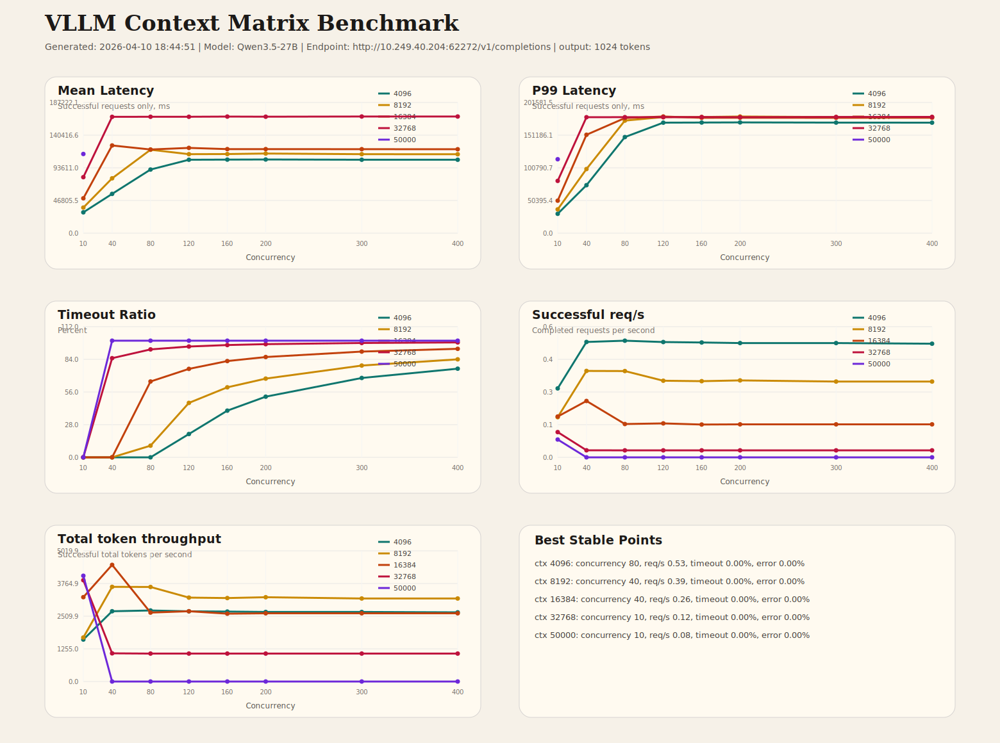

# VLLM 上下文/并发矩阵吞吐测试报告

- 生成时间: 2026-04-10 18:44:51
- 模型: `Qwen3.5-27B`
- Endpoint: `http://10.249.40.204:62272/v1/completions`
- 服务端 max_model_len: `50000`
- 输出长度: `1024` token
- 说明: `50000` 这一组按总上下文 50000 处理，实际输入目标调整为 `48975`，为输出预留 1024 token。

## 图表

## 各上下文最佳稳定点

- `4096`: 并发 `80`, req/s `0.53`, timeout `0.00%`, error `0.00%`, mean `91087.36` ms, P99 `148241.43` ms。
- `8192`: 并发 `40`, req/s `0.39`, timeout `0.00%`, error `0.00%`, mean `78558.99` ms, P99 `98918.32` ms。
- `16384`: 并发 `40`, req/s `0.26`, timeout `0.00%`, error `0.00%`, mean `125612.55` ms, P99 `151751.22` ms。
- `32768`: 并发 `10`, req/s `0.12`, timeout `0.00%`, error `0.00%`, mean `80189.04` ms, P99 `80609.50` ms。
- `50000`: 并发 `10`, req/s `0.08`, timeout `0.00%`, error `0.00%`, mean `113400.04` ms, P99 `114070.42` ms。

## 汇总表

| Context | Concurrency | Success | Timeout% | Error% | Mean(ms) | P99(ms) | req/s | tok/s |
| ---: | ---: | ---: | ---: | ---: | ---: | ---: | ---: | ---: |
| 4096 | 10 | 10/10 | 0.00% | 0.00% | 29794.94 | 29842.82 | 0.31 | 1611.94 |
| 4096 | 40 | 40/40 | 0.00% | 0.00% | 56251.53 | 74021.50 | 0.53 | 2698.46 |
| 4096 | 80 | 80/80 | 0.00% | 0.00% | 91087.36 | 148241.43 | 0.53 | 2728.40 |
| 4096 | 120 | 96/120 | 20.00% | 0.00% | 105201.79 | 170501.13 | 0.53 | 2696.38 |
| 4096 | 160 | 96/160 | 40.00% | 0.00% | 105331.99 | 170633.48 | 0.52 | 2686.54 |
| 4096 | 200 | 96/200 | 52.00% | 0.00% | 105525.47 | 170831.79 | 0.52 | 2671.97 |
| 4096 | 300 | 96/300 | 68.00% | 0.00% | 105202.07 | 170523.82 | 0.52 | 2671.78 |
| 4096 | 400 | 96/400 | 76.00% | 0.00% | 105174.50 | 170419.85 | 0.52 | 2657.49 |
| 8192 | 10 | 10/10 | 0.00% | 0.00% | 36584.48 | 36682.08 | 0.18 | 1690.87 |
| 8192 | 40 | 40/40 | 0.00% | 0.00% | 78558.99 | 98918.32 | 0.39 | 3637.69 |
| 8192 | 80 | 72/80 | 10.00% | 0.00% | 119510.70 | 173658.98 | 0.39 | 3631.28 |
| 8192 | 120 | 64/120 | 46.67% | 0.00% | 113163.39 | 179092.10 | 0.35 | 3223.49 |
| 8192 | 160 | 64/160 | 60.00% | 0.00% | 113323.43 | 179175.25 | 0.35 | 3205.84 |
| 8192 | 200 | 65/200 | 67.50% | 0.00% | 114095.47 | 179975.89 | 0.35 | 3238.51 |
| 8192 | 300 | 64/300 | 78.67% | 0.00% | 113116.88 | 179002.43 | 0.35 | 3188.73 |
| 8192 | 400 | 64/400 | 84.00% | 0.00% | 113108.23 | 178987.21 | 0.35 | 3188.88 |
| 16384 | 10 | 10/10 | 0.00% | 0.00% | 49912.22 | 50110.78 | 0.19 | 3241.86 |
| 16384 | 40 | 40/40 | 0.00% | 0.00% | 125612.55 | 151751.22 | 0.26 | 4482.04 |
| 16384 | 80 | 28/80 | 65.00% | 0.00% | 119833.33 | 177576.25 | 0.15 | 2648.68 |
| 16384 | 120 | 29/120 | 75.83% | 0.00% | 122142.58 | 179983.46 | 0.16 | 2699.87 |
| 16384 | 160 | 28/160 | 82.50% | 0.00% | 120384.23 | 178006.38 | 0.15 | 2606.92 |
| 16384 | 200 | 28/200 | 86.00% | 0.00% | 120373.54 | 178058.89 | 0.15 | 2620.73 |
| 16384 | 300 | 28/300 | 90.67% | 0.00% | 120278.74 | 177930.65 | 0.15 | 2620.62 |
| 16384 | 400 | 28/400 | 93.00% | 0.00% | 120262.50 | 178070.00 | 0.15 | 2620.74 |
| 32768 | 10 | 10/10 | 0.00% | 0.00% | 80189.04 | 80609.50 | 0.12 | 3892.11 |
| 32768 | 40 | 6/40 | 85.00% | 0.00% | 166709.48 | 178866.66 | 0.03 | 1083.82 |
| 32768 | 80 | 6/80 | 92.50% | 0.00% | 166784.91 | 178929.72 | 0.03 | 1072.71 |
| 32768 | 120 | 6/120 | 95.00% | 0.00% | 166765.01 | 178893.10 | 0.03 | 1072.89 |
| 32768 | 160 | 6/160 | 96.25% | 0.00% | 167010.18 | 179192.91 | 0.03 | 1072.87 |
| 32768 | 200 | 6/200 | 97.00% | 0.00% | 166822.97 | 178966.09 | 0.03 | 1072.80 |
| 32768 | 300 | 6/300 | 98.00% | 0.00% | 167089.12 | 179270.60 | 0.03 | 1072.75 |
| 32768 | 400 | 6/400 | 98.50% | 0.00% | 167162.57 | 179320.86 | 0.03 | 1072.92 |
| 50000 | 10 | 10/10 | 0.00% | 0.00% | 113400.04 | 114070.42 | 0.08 | 4063.61 |
| 50000 | 40 | 0/40 | 100.00% | 0.00% | N/A | N/A | 0.00 | 0.00 |
| 50000 | 80 | 0/80 | 100.00% | 0.00% | N/A | N/A | 0.00 | 0.00 |
| 50000 | 120 | 0/120 | 100.00% | 0.00% | N/A | N/A | 0.00 | 0.00 |
| 50000 | 160 | 0/160 | 100.00% | 0.00% | N/A | N/A | 0.00 | 0.00 |
| 50000 | 200 | 0/200 | 100.00% | 0.00% | N/A | N/A | 0.00 | 0.00 |
| 50000 | 300 | 0/300 | 100.00% | 0.00% | N/A | N/A | 0.00 | 0.00 |
| 50000 | 400 | 0/400 | 100.00% | 0.00% | N/A | N/A | 0.00 | 0.00 |
