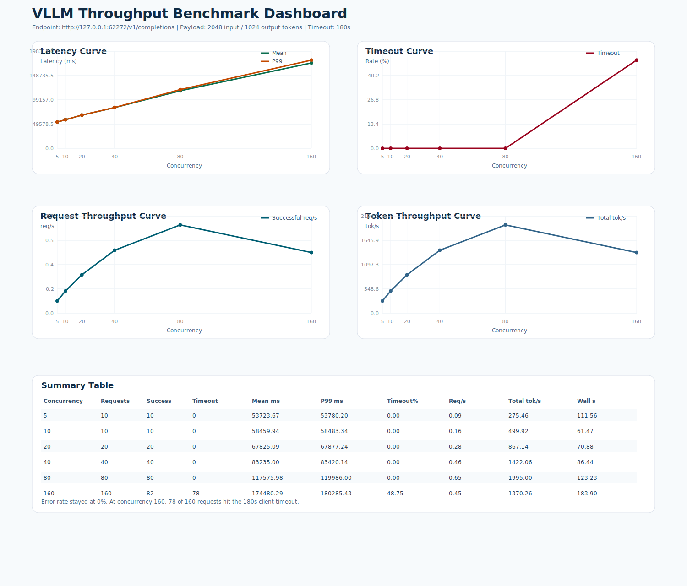

# VLLM 精细化吞吐测试报告

- 测试时间: 2026-03-30 13:57:00
- Conda 环境: `xtyAgent`
- 接口: `http://127.0.0.1:62272/v1/completions`
- 负载: `2048` 输入 token / `1024` 输出 token
- 并发矩阵: `5 10 20 40 80 160`
- 客户端 timeout: `180s`
- 请求数策略: `max(并发数, 10)`

## 结论

- 最低延迟在并发 `5`，mean `53723.67 ms`。
- 最高成功吞吐在并发 `80`，约 `0.65 req/s`，总 token 吞吐约 `1995.00 tok/s`。
- 首个出现 timeout 的点是并发 `160`，timeout 比例 `48.75%`。
- 非 timeout error 为 `0`，失败全部来自 timeout。

## 汇总表

| 并发 | 请求数 | 成功 | Timeout | Mean(ms) | P99(ms) | Timeout% | Req/s | Total tok/s |
| ---: | ---: | ---: | ---: | ---: | ---: | ---: | ---: | ---: |
| 5 | 10 | 10 | 0 | 53723.67 | 53780.20 | 0.00 | 0.09 | 275.46 |
| 10 | 10 | 10 | 0 | 58459.94 | 58483.34 | 0.00 | 0.16 | 499.92 |
| 20 | 20 | 20 | 0 | 67825.09 | 67877.24 | 0.00 | 0.28 | 867.14 |
| 40 | 40 | 40 | 0 | 83235.00 | 83420.14 | 0.00 | 0.46 | 1422.06 |
| 80 | 80 | 80 | 0 | 117575.98 | 119986.00 | 0.00 | 0.65 | 1995.00 |
| 160 | 160 | 82 | 78 | 174480.29 | 180285.43 | 48.75 | 0.45 | 1370.26 |

## 图表

