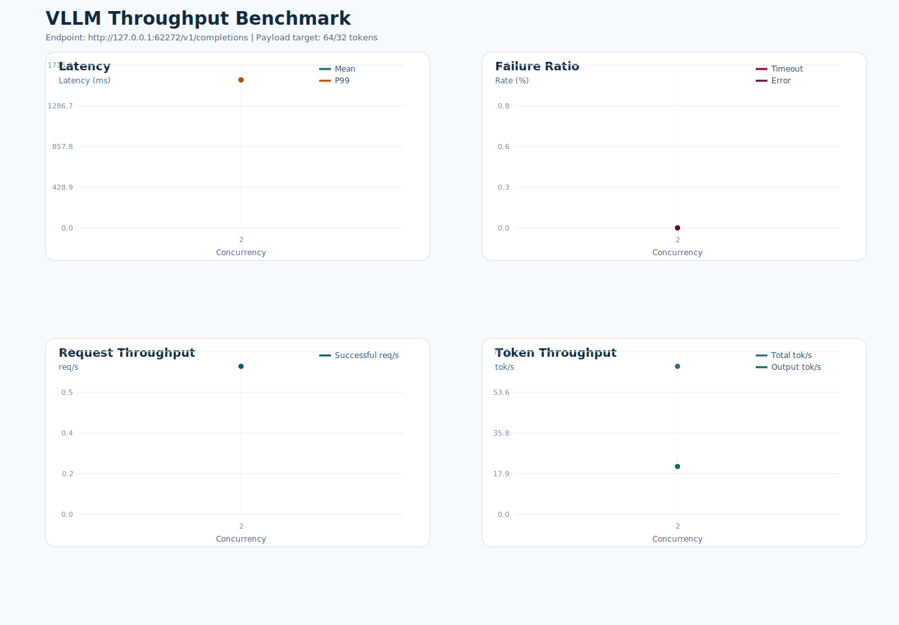

# VLLM 吞吐测试报告

- 测试时间: 2026-03-30 12:57:45
- Conda 环境: `xtyAgent`
- 基准接口: `http://127.0.0.1:62272/v1/completions`
- 模型名: `Qwen3-32B`
- 模型路径: `/data1/dlx/projects/vllm_xty/model`
- tokenizer 路径: `/data1/dlx/projects/vllm_xty/model`
- 目标负载: 输入 `64` token, 输出 `32` token
- 实际构造 prompt token 数: 约 `67`
- 客户端超时阈值: `60` 秒
- 请求数策略: `max(并发数, 2)`

## 结果概览

- 最高成功吞吐出现在并发 `2`，约 `0.66` req/s。
- 最低 timeout 比例出现在并发 `2`，约 `0.00%`。
- 详细汇总见 `summary.csv`，图表见 `benchmark.svg`。

## 汇总表

| 并发数 | 请求数 | 成功 | 失败 | Timeout | Error | Mean Latency(ms) | P99(ms) | Timeout% | Error% | Success req/s | Total tok/s |
| ---: | ---: | ---: | ---: | ---: | ---: | ---: | ---: | ---: | ---: | ---: | ---: |
| 2 | 2 | 2 | 0 | 0 | 0 | 1559.62 | 1559.66 | 0.00 | 0.00 | 0.66 | 65.02 |

## 说明

- `Error%` 仅统计非 timeout 失败请求占比，例如 HTTP 5xx 或连接异常。
- `Timeout%` 单独统计客户端在超时阈值内未收到完整响应的请求占比。
- 延迟统计仅基于成功请求的端到端响应时间。

